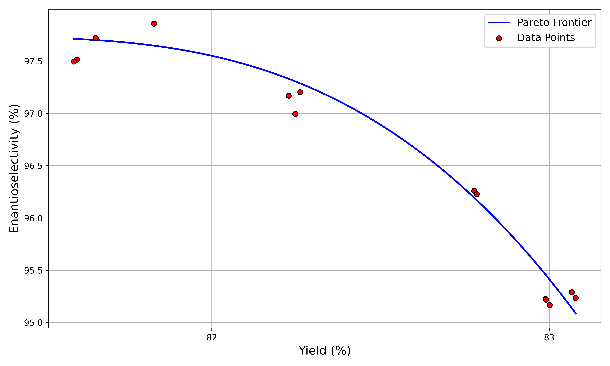

# Continuous Flow Process Optimization with Machine Learning

This repository contains the code implementation for the paper titled "Continuous Flow Process Optimization Aided by Machine Learning for a Pharmaceutical Intermediate."


Here is the MOO results for our paper to balance the yields and the enantioselectivity for continuous flow chemistry



## Setup

To set up the required environment, follow these steps:

```bash
# Create and activate a virtual environment
mamba create -n flow python=3.7
mamba activate flow

# Install PyTorch and dependencies
mamba install pytorch torchvision torchaudio pytorch-cuda=11.7 -c pytorch -c nvidia

# Install RDKit and Mordred
mamba install -c rdkit -c mordred-descriptor mordred rdkit

# Install other dependencies
mamba install cudatoolkit=11.7 py-xgboost-gpu shap
mamba install jupyter ipykernel rich fire pandas

# Install NexTorch
python -m pip install nextorch

# Clone and test the NexTorch repo
git clone https://github.com/VlachosGroup/nextorch.git
cd nextorch
pytest --pyargs nextorch
```

### Optional Dependencies

You can also install optional dependencies for additional functionality:

```bash
# Openbox (for HTML Visualization)
python -m pip install "openbox[extra]"

# EDBO
cd software
git clone https://github.com/b-shields/edbo
cd edbo
python -m pip install -e .

# AutoSklearn
sudo apt-get install build-essential swig python3-dev

mamba create -n autosklearn python=3.8
mamba activate autosklearn
git clone https://github.com/automl/auto-sklearn.git
cd auto-sklearn
git submodule update --init --recursive
pip install -e ".[test,docs,examples]" --dry-run
```

## Reproduction

You can replicate the research results using the following notebook scripts:

1. `notebooks/EDA.ipynb`: This notebook performs a feature contribution analysis using AutoSklearn and SHAP tools to gain insights into the dataset.

2. `notebooks/Single-Objective Optimization.ipynb`: This notebook focuses on single-objective target optimization for continuous flow process optimization, specifically optimizing the yield.

3. `notebooks/Multi-Objective Optimization.ipynb`: In this notebook, multi-objective optimization is conducted, considering both yield and enantioselectivity as objectives to optimize simultaneously.
